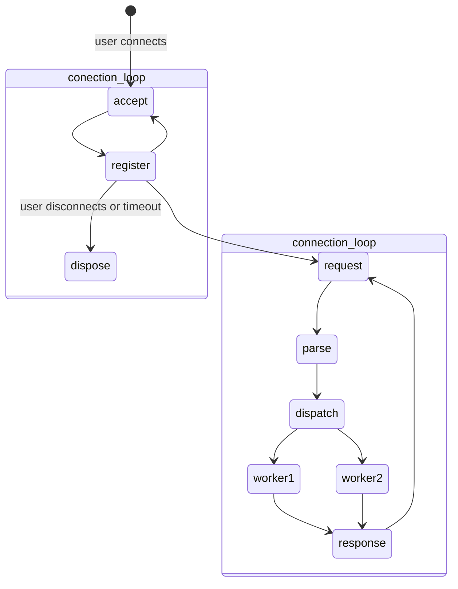

```mermaid
    stateDiagram

    [*] --> accept: user connects
    state conection_loop {
        accept --> register
        register --> accept
        register --> request

        register --> dispose: user disconnects or timeout
    }

    state connection_loop {
        request --> parse
        parse --> dispatch

        dispatch --> worker1
        dispatch --> worker2
        worker1 --> response
        worker2 --> response

        response --> request
    }
```