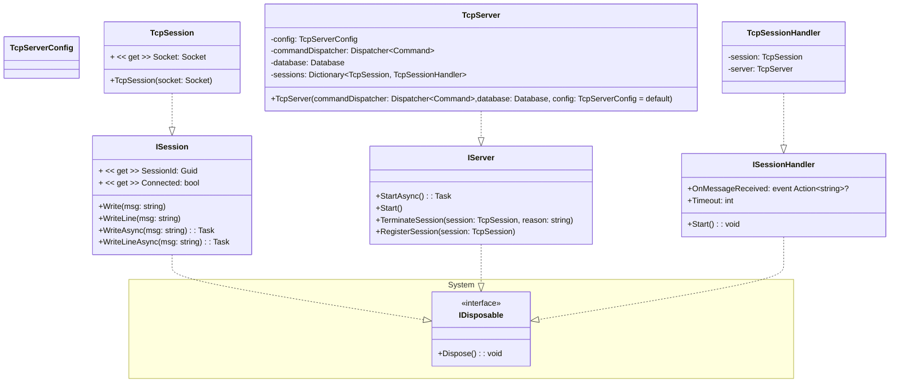

```mermaid
    classDiagram

    namespace System {
        class IDisposable {
            <<interface>>
            +Dispose(): void
        }
    }

    class TcpServerConfig
    
    class ISession {
        + << get >> SessionId: Guid
        + << get >> Connected: bool

        +Write(msg: string)
        +WriteLine(msg: string)
        
        +WriteAsync(msg: string): Task
        +WriteLineAsync(msg: string): Task
    }
    ISession ..|> IDisposable

    class IServer {
        +StartAsync(): Task
        +Start()
        +TerminateSession(session: TcpSession, reason: string)
        +RegisterSession(session: TcpSession)
    }
    IServer ..|> IDisposable
    
    class ISessionHandler {
        +OnMessageReceived: event Action~string~?
        +Timeout: int

        +Start(): void
    }
    ISessionHandler ..|> IDisposable


    class TcpSession {
        + << get >> Socket: Socket
        
        +TcpSession(socket: Socket)
    }
    TcpSession ..|> ISession

    class TcpServer {
        -config: TcpServerConfig
        -commandDispatcher: Dispatcher~Command~
        -database: Database 
        -sessions: Dictionary~TcpSession, TcpSessionHandler~

        +TcpServer(commandDispatcher: Dispatcher~Command~,database: Database, config: TcpServerConfig = default)
    }
    TcpServer ..|> IServer
    
    class TcpSessionHandler {
        -session: TcpSession
        -server: TcpServer
    }
    TcpSessionHandler ..|> ISessionHandler


```