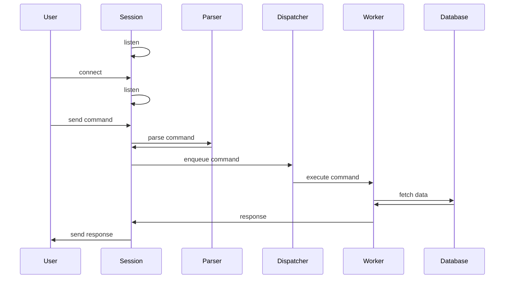

```mermaid
    sequenceDiagram

    participant User
    participant Session
    participant Parser
    participant Dispatcher
    participant Worker
    participant Database
    
    Session ->> Session: listen
    User ->> Session: connect
    Session ->> Session: listen
    User ->> Session: send command
    Session ->> Parser: parse command
    Parser ->> Session: 
    Session ->> Dispatcher: enqueue command
    Dispatcher ->> Worker: execute command
    Worker ->> Database: fetch data
    Database ->> Worker:
    Worker ->> Session: response
    Session ->> User: send response

```