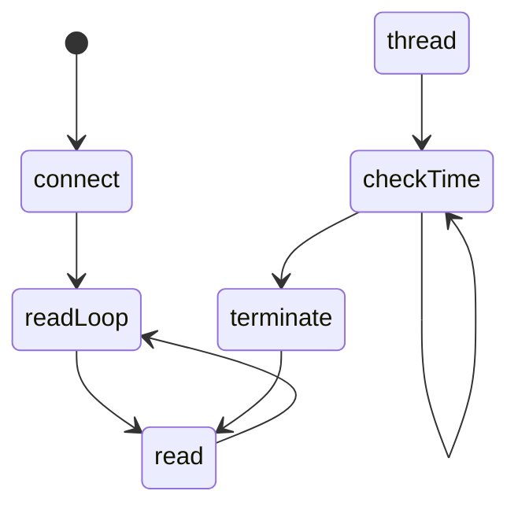

```mermaid
stateDiagram
    [*] --> connect
    connect --> readLoop
    read --> readLoop
    readLoop--> read
    
    thread --> checkTime
    checkTime --> checkTime
    checkTime --> terminate
    terminate --> read
```